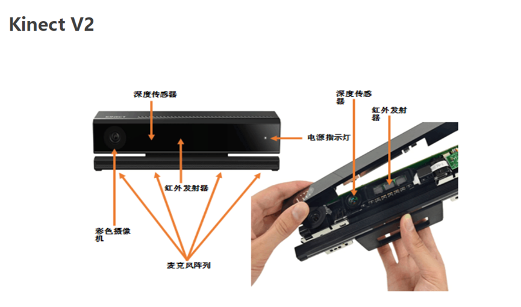
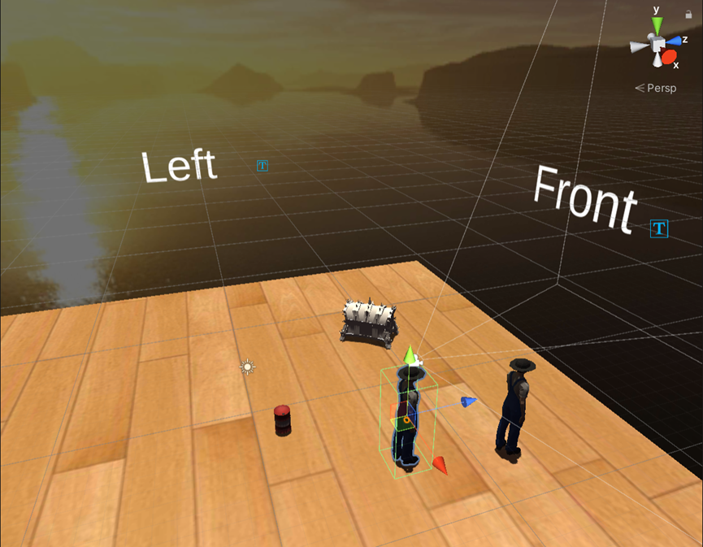

# Maze VR 

This project is a VR project using Unity3d and Kinect. The project is based on the [Kinect for Windows SDK](https://www.microsoft.com/en-us/download/details.aspx?id=40278) and toolset from [Dr. Gai](https://faculty.sdu.edu.cn/gaiwei1/zh_CN/index.htm), Shandong University.

> If you want to run this project, please contact Dr. Gai for individual toolset permission.

## Usage 

1. Connect Kinect to your computer.

2. Open toolset and change IP address / port number according to your network environment.

3. Compile VR Project to Android APK and install it on your Android phone.

4. Open APP and have fun :-)